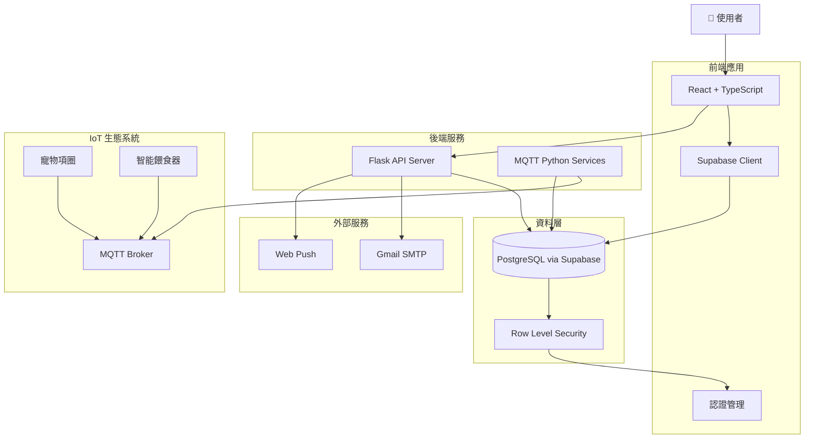
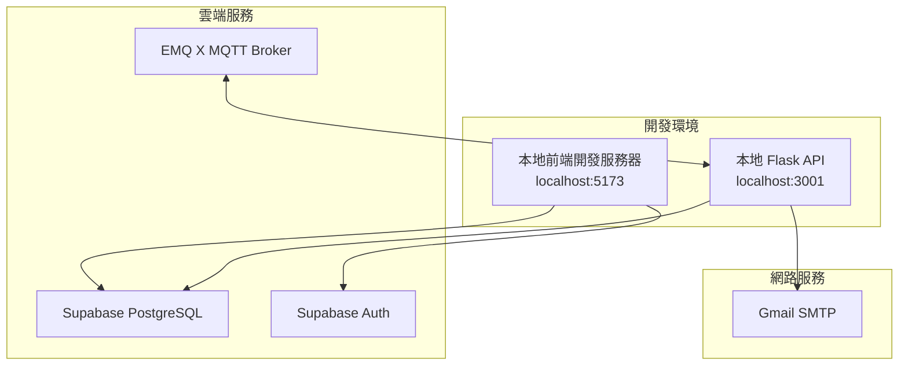
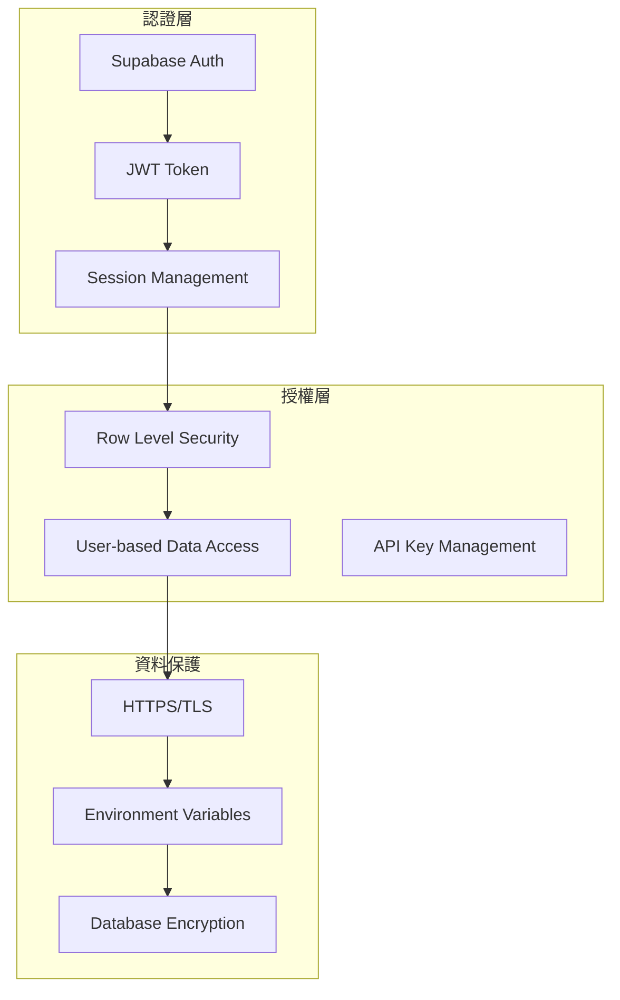
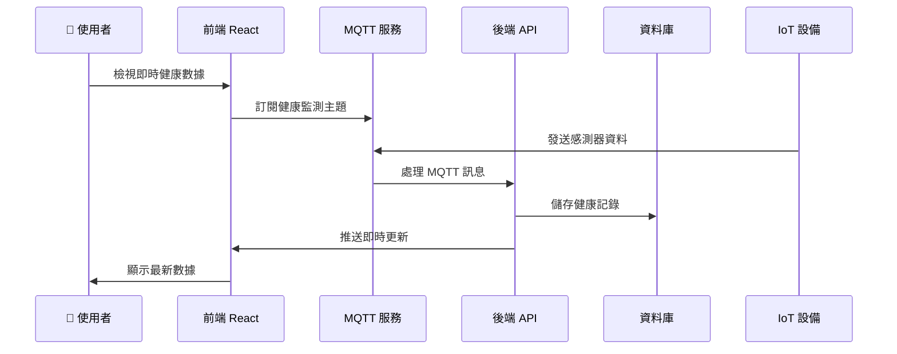

# PawsConnect 系統架構圖

## 整體系統架構

```mermaid
graph TB
    %% 前端層
    subgraph "前端 Frontend (React + TypeScript)"
        FE1[儀表板 Dashboard]
        FE2[寵物檔案 Pet Profile]
        FE3[健康監測 Health Monitor]
        FE4[餵食紀錄 Feeding Record]
        FE5[疫苗紀錄 Vaccine Record]
        FE6[登入認證 Auth]
    end

    %% 後端層
    subgraph "後端層 Backend Services"
        subgraph "Python Flask API"
            BE1[app.py - 主要 API 服務]
            BE2[vaccine_reminder_scheduler.py]
            BE3[reminder_mailer.py]
            BE4[SMTP 郵件服務]
        end
        
        subgraph "MQTT 物聯網服務"
            BE5[mqtt_client.py - 健康監測]
            BE6[mqtt_feeding_client.py - 餵食器]
            BE7[mqtt_feeder_command_sender.py]
        end
    end

    %% 資料庫層
    subgraph "資料庫層 Database (Supabase PostgreSQL)"
        DB1[(pets - 寵物資料)]
        DB2[(health_records - 健康記錄)]
        DB3[(feeding_records - 餵食記錄)]
        DB4[(vaccine_records - 疫苗記錄)]
        DB5[(user_fcm_tokens - 推播代碼)]
        DB6[(feeding_schedules - 定時餵食)]
    end

    %% 外部服務
    subgraph "外部服務 External Services"
        EXT1[MQTT Broker - broker.emqx.io]
        EXT2[Gmail SMTP 郵件服務]
        EXT3[Web Push 推播服務]
    end

    %% 硬體設備
    subgraph "物聯網硬體 IoT Hardware"
        HW1[寵物項圈感測器]
        HW2[智能餵食器]
    end

    %% 連接關係
    %% 前端到後端
    FE1 --> BE1
    FE2 --> BE1
    FE3 --> BE1
    FE4 --> BE1
    FE5 --> BE1
    FE6 --> BE1

    %% 前端直接到資料庫 (Supabase Client)
    FE1 -.-> DB1
    FE2 -.-> DB1
    FE3 -.-> DB2
    FE4 -.-> DB3
    FE4 -.-> DB6
    FE5 -.-> DB4

    %% 後端到資料庫
    BE1 --> DB5
    BE2 --> DB4
    BE3 --> DB1
    BE5 --> DB2
    BE6 --> DB3

    %% 後端到外部服務
    BE1 --> EXT2
    BE1 --> EXT3
    BE2 --> EXT2

    %% MQTT 連接
    BE5 --> EXT1
    BE6 --> EXT1
    BE7 --> EXT1

    %% 硬體到 MQTT
    HW1 --> EXT1
    HW2 --> EXT1

    %% 樣式定義
    classDef frontend fill:#e1f5fe,stroke:#01579b,stroke-width:2px
    classDef backend fill:#f3e5f5,stroke:#4a148c,stroke-width:2px
    classDef database fill:#e8f5e8,stroke:#1b5e20,stroke-width:2px
    classDef external fill:#fff3e0,stroke:#e65100,stroke-width:2px
    classDef hardware fill:#ffebee,stroke:#b71c1c,stroke-width:2px

    class FE1,FE2,FE3,FE4,FE5,FE6 frontend
    class BE1,BE2,BE3,BE4,BE5,BE6,BE7 backend
    class DB1,DB2,DB3,DB4,DB5,DB6 database
    class EXT1,EXT2,EXT3 external
    class HW1,HW2 hardware
```



## 資料流架構



## API 端點架構

```mermaid
graph LR
    subgraph "前端路由"
        R1[/dashboard]
        R2[/pets]
        R3[/health]
        R4[/feeding]
        R5[/vaccines]
    end
    
    subgraph "後端 API"
        API1[POST /api/save-subscription]
        API2[POST /api/send-webpush]
        API3[POST /api/send-vaccine-reminder]
        API4[GET /api/health]
    end
    
    subgraph "Supabase API"
        SUPA1[pets table]
        SUPA2[health_records table]
        SUPA3[feeding_records table]
        SUPA4[vaccine_records table]
        SUPA5[feeding_schedules table]
    end
    
    subgraph "MQTT Topics"
        MQTT1[pet/manager/topic/collar]
        MQTT2[pet/manager/topic/feeding]
        MQTT3[pet/manager/topic/start]
        MQTT4[pet/manager/topic/stop]
    end
    
    R1 --> SUPA4
    R2 --> SUPA1
    R3 --> SUPA2
    R4 --> SUPA3
    R4 --> SUPA5
    R5 --> SUPA4
    R5 --> API3
    
    API1 --> SUPA1
    API2 --> SUPA1
    API3 --> SUPA4
```

## 技術棧詳細說明

### 前端 Frontend

- **框架**: React 18 + TypeScript
- **狀態管理**: Zustand
- **路由**: React Router DOM
- **UI 組件**: Chakra UI + Tailwind CSS
- **資料庫客戶端**: Supabase JavaScript Client
- **通訊協定**:
  - HTTP/HTTPS (REST API)
  - WebSocket (即時通訊)
  - MQTT over WebSocket (IoT 設備)

### 後端 Backend

- **主要 API**: Python Flask
- **任務排程**: Python 定時腳本
- **物聯網通訊**: MQTT (paho-mqtt)
- **郵件服務**: SMTP (Gmail)
- **推播服務**: Web Push API

### 資料庫 Database

- **主資料庫**: PostgreSQL (Supabase)
- **安全機制**: Row Level Security (RLS)
- **即時同步**: Supabase Realtime
- **認證**: Supabase Auth

### 物聯網 IoT

- **通訊協定**: MQTT
- **訊息代理**: EMQ X (broker.emqx.io)
- **設備類型**:
  - 寵物健康監測項圈
  - 智能餵食器

### 外部服務 External Services

- **郵件**: Gmail SMTP
- **推播**: Web Push Protocol
- **認證**: Supabase Auth

## 部署架構



## 安全架構



## 即時功能架構



這個系統架構圖展示了你的 PawsConnect 寵物健康管理系統的完整技術架構，包含前端、後端、資料庫、物聯網設備整合以及外部服務的所有組件和它們之間的交互關係。
