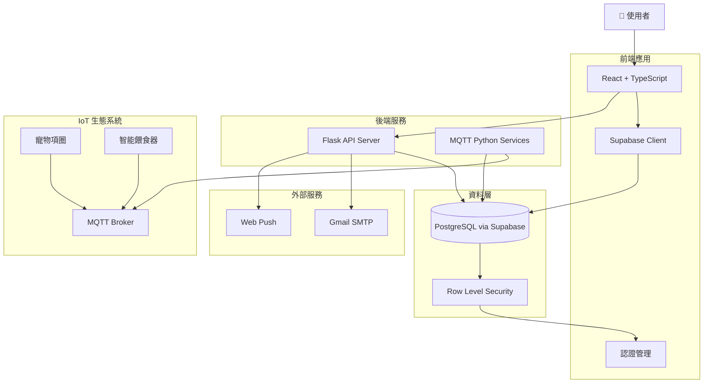
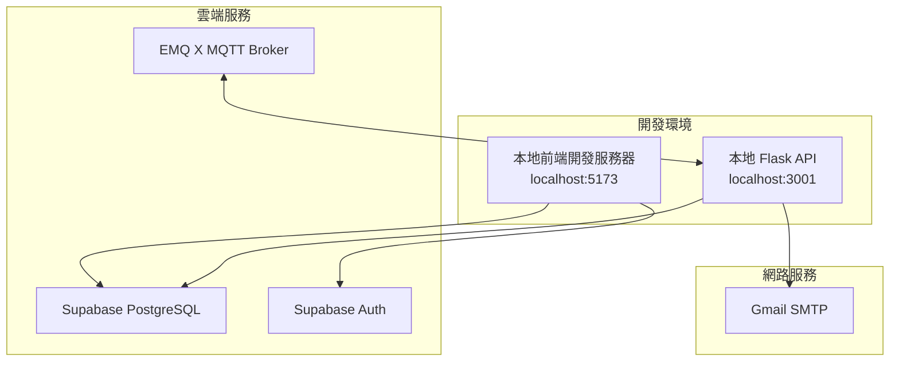
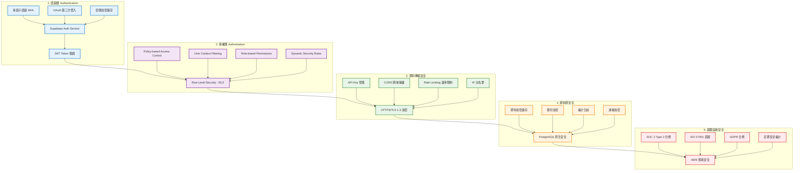
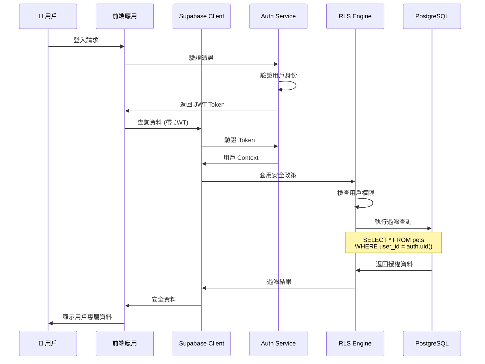
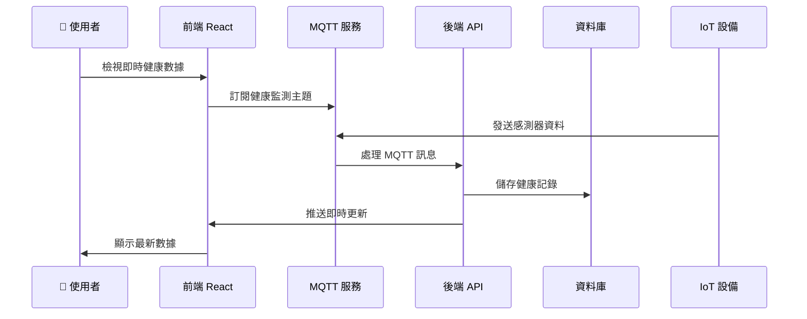
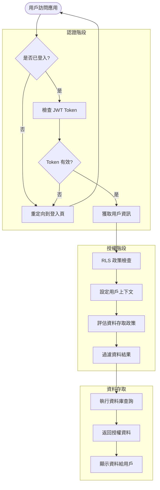

# PawsConnect 系統架構圖

## 整體系統架構

```mermaid
graph TB
    %% 前端層
    subgraph "前端 Frontend (React + TypeScript)"
        FE1[儀表板 Dashboard]
        FE2[寵物檔案 Pet Profile]
        FE3[健康監測 Health Monitor]
        FE4[餵食紀錄 Feeding Record]
        FE5[疫苗紀錄 Vaccine Record]
        FE6[登入認證 Auth]
    end

    %% 後端層
    subgraph "後端層 Backend Services"
        subgraph "Python Flask API"
            BE1[app.py - 主要 API 服務]
            BE2[vaccine_reminder_scheduler.py]
            BE3[reminder_mailer.py]
            BE4[SMTP 郵件服務]
        end
        
        subgraph "MQTT 物聯網服務"
            BE5[mqtt_client.py - 健康監測]
            BE6[mqtt_feeding_client.py - 餵食器]
            BE7[mqtt_feeder_command_sender.py]
        end
    end

    %% 資料庫層
    subgraph "資料庫層 Database (Supabase PostgreSQL)"
        DB1[(pets - 寵物資料)]
        DB2[(health_records - 健康記錄)]
        DB3[(feeding_records - 餵食記錄)]
        DB4[(vaccine_records - 疫苗記錄)]
        DB5[(user_fcm_tokens - 推播代碼)]
        DB6[(feeding_schedules - 定時餵食)]
    end

    %% 外部服務
    subgraph "外部服務 External Services"
        EXT1[MQTT Broker - broker.emqx.io]
        EXT2[Gmail SMTP 郵件服務]
        EXT3[Web Push 推播服務]
    end

    %% 硬體設備
    subgraph "物聯網硬體 IoT Hardware"
        HW1[寵物項圈感測器]
        HW2[智能餵食器]
    end

    %% 連接關係
    %% 前端到後端
    FE1 --> BE1
    FE2 --> BE1
    FE3 --> BE1
    FE4 --> BE1
    FE5 --> BE1
    FE6 --> BE1

    %% 前端直接到資料庫 (Supabase Client)
    FE1 -.-> DB1
    FE2 -.-> DB1
    FE3 -.-> DB2
    FE4 -.-> DB3
    FE4 -.-> DB6
    FE5 -.-> DB4

    %% 後端到資料庫
    BE1 --> DB5
    BE2 --> DB4
    BE3 --> DB1
    BE5 --> DB2
    BE6 --> DB3

    %% 後端到外部服務
    BE1 --> EXT2
    BE1 --> EXT3
    BE2 --> EXT2

    %% MQTT 連接
    BE5 --> EXT1
    BE6 --> EXT1
    BE7 --> EXT1

    %% 硬體到 MQTT
    HW1 --> EXT1
    HW2 --> EXT1

    %% 樣式定義
    classDef frontend fill:#e1f5fe,stroke:#01579b,stroke-width:2px
    classDef backend fill:#f3e5f5,stroke:#4a148c,stroke-width:2px
    classDef database fill:#e8f5e8,stroke:#1b5e20,stroke-width:2px
    classDef external fill:#fff3e0,stroke:#e65100,stroke-width:2px
    classDef hardware fill:#ffebee,stroke:#b71c1c,stroke-width:2px

    class FE1,FE2,FE3,FE4,FE5,FE6 frontend
    class BE1,BE2,BE3,BE4,BE5,BE6,BE7 backend
    class DB1,DB2,DB3,DB4,DB5,DB6 database
    class EXT1,EXT2,EXT3 external
    class HW1,HW2 hardware
```



## 資料流架構



## API 端點架構

```mermaid
graph LR
    subgraph "前端路由"
        R1[/dashboard]
        R2[/pets]
        R3[/health]
        R4[/feeding]
        R5[/vaccines]
    end
    
    subgraph "後端 API"
        API1[POST /api/save-subscription]
        API2[POST /api/send-webpush]
        API3[POST /api/send-vaccine-reminder]
        API4[GET /api/health]
    end
    
    subgraph "Supabase API"
        SUPA1[pets table]
        SUPA2[health_records table]
        SUPA3[feeding_records table]
        SUPA4[vaccine_records table]
        SUPA5[feeding_schedules table]
    end
    
    subgraph "MQTT Topics"
        MQTT1[pet/manager/topic/collar]
        MQTT2[pet/manager/topic/feeding]
        MQTT3[pet/manager/topic/start]
        MQTT4[pet/manager/topic/stop]
    end
    
    R1 --> SUPA4
    R2 --> SUPA1
    R3 --> SUPA2
    R4 --> SUPA3
    R4 --> SUPA5
    R5 --> SUPA4
    R5 --> API3
    
    API1 --> SUPA1
    API2 --> SUPA1
    API3 --> SUPA4
```

## 技術棧詳細說明

### 前端 Frontend

- **框架**: React 18 + TypeScript
- **狀態管理**: Zustand
- **路由**: React Router DOM
- **UI 組件**: Chakra UI + Tailwind CSS
- **資料庫客戶端**: Supabase JavaScript Client
- **通訊協定**:
  - HTTP/HTTPS (REST API)
  - WebSocket (即時通訊)
  - MQTT over WebSocket (IoT 設備)

### 後端 Backend

- **主要 API**: Python Flask
- **任務排程**: Python 定時腳本
- **物聯網通訊**: MQTT (paho-mqtt)
- **郵件服務**: SMTP (Gmail)
- **推播服務**: Web Push API

### 資料庫 Database

- **主資料庫**: PostgreSQL (Supabase)
- **安全機制**: Row Level Security (RLS)
- **即時同步**: Supabase Realtime
- **認證**: Supabase Auth

### 物聯網 IoT

- **通訊協定**: MQTT
- **訊息代理**: EMQ X (broker.emqx.io)
- **設備類型**:
  - 寵物健康監測項圈
  - 智能餵食器

### 外部服務 External Services

- **郵件**: Gmail SMTP
- **推播**: Web Push Protocol
- **認證**: Supabase Auth

## 部署架構



## Supabase 資料安全架構

### 多層安全防護機制



### Row Level Security (RLS) 詳細說明



## 即時功能架構



### PawsConnect 專案中的 RLS 實作範例

```sql
-- 1. 啟用 pets 表的 RLS
ALTER TABLE public.pets ENABLE ROW LEVEL SECURITY;

-- 2. 建立安全政策：用戶只能存取自己的寵物資料
CREATE POLICY "Users can only access their own pets" ON public.pets
    FOR ALL USING (auth.uid() = user_id);

-- 3. 建立插入政策：用戶只能插入自己的寵物資料
CREATE POLICY "Users can only insert their own pets" ON public.pets
    FOR INSERT WITH CHECK (auth.uid() = user_id);

-- 4. 建立更新政策：用戶只能更新自己的寵物資料
CREATE POLICY "Users can only update their own pets" ON public.pets
    FOR UPDATE USING (auth.uid() = user_id);

-- 5. 建立刪除政策：用戶只能刪除自己的寵物資料
CREATE POLICY "Users can only delete their own pets" ON public.pets
    FOR DELETE USING (auth.uid() = user_id);
```

### 認證與授權流程



### 資料安全等級分類

| 資料類型 | 安全等級 | 保護機制 | 存取控制 |
|---------|---------|---------|---------|
| **用戶認證資料** | 🔴 最高 | 加密儲存 + MFA | 系統級存取 |
| **寵物個人資料** | 🟡 高 | RLS + 用戶隔離 | 用戶專屬 |
| **健康記錄** | 🟡 高 | RLS + 審計日誌 | 用戶專屬 |
| **餵食記錄** | 🟡 高 | RLS + 時間戳記 | 用戶專屬 |
| **疫苗記錄** | 🟡 高 | RLS + 加密傳輸 | 用戶專屬 |
| **系統設定** | 🟢 中 | 管理員權限 | 角色控制 |

### Supabase 安全功能清單

#### 🔐 認證 (Authentication)

- **JWT Token 機制**: 無狀態認證，自動過期
- **密碼安全**: bcrypt 加密，強密碼政策
- **多因子認證**: TOTP, SMS, Email 驗證
- **OAuth 整合**: Google, GitHub, Apple 等第三方登入
- **Session 管理**: 自動續期，安全登出

#### 🛡️ 授權 (Authorization)

- **Row Level Security**: 資料庫層級的細粒度控制
- **政策引擎**: 靈活的存取控制規則
- **角色管理**: 基於角色的權限分配
- **動態權限**: 基於上下文的權限檢查

#### 🌐 網路安全

- **TLS 1.3 加密**: 端到端資料傳輸加密
- **API Key 管理**: 分層式 API 金鑰系統
- **CORS 保護**: 跨域請求安全控制
- **Rate Limiting**: API 調用頻率限制
- **DDoS 防護**: 基礎設施層防護

#### 💾 資料庫安全

- **資料加密**: 靜態資料 AES-256 加密
- **連線加密**: SSL/TLS 資料庫連線
- **備份安全**: 加密備份，異地儲存
- **審計日誌**: 完整的操作記錄
- **資料去識別化**: 個人資料保護

#### ☁️ 基礎設施安全

- **AWS 安全**: 企業級雲端安全基礎
- **SOC 2 Type 2**: 系統安全性與可用性認證
- **ISO 27001**: 資訊安全管理標準
- **GDPR 合規**: 歐盟資料保護法規遵循
- **定期滲透測試**: 第三方安全評估

### 在 PawsConnect 中的安全實作

```typescript
// 前端：自動帶入用戶認證
const { data: pets, error } = await supabase
  .from('pets')
  .select('*')  // RLS 自動過濾為當前用戶的寵物

// 後端：使用 service role 繞過 RLS (謹慎使用)
const supabase = createClient(url, SERVICE_ROLE_KEY)
const { data } = await supabase
  .from('health_records')
  .insert({ pet_id, temperature, user_id: userId })
```

### 安全最佳實踐建議

1. **🔑 金鑰管理**
   - 使用環境變數儲存敏感金鑰
   - 定期輪換 API 金鑰
   - 分離開發/生產環境金鑰

2. **👥 用戶權限**
   - 最小權限原則
   - 定期審查用戶權限
   - 實作角色分離

3. **📊 監控與審計**
   - 啟用詳細日誌記錄
   - 設定異常活動警報
   - 定期安全審計

4. **🔄 資料備份**
   - 自動化加密備份
   - 異地備份儲存
   - 定期備份恢復測試

這些安全機制確保了 PawsConnect 專案中的寵物資料和用戶隱私得到全方位的保護。
